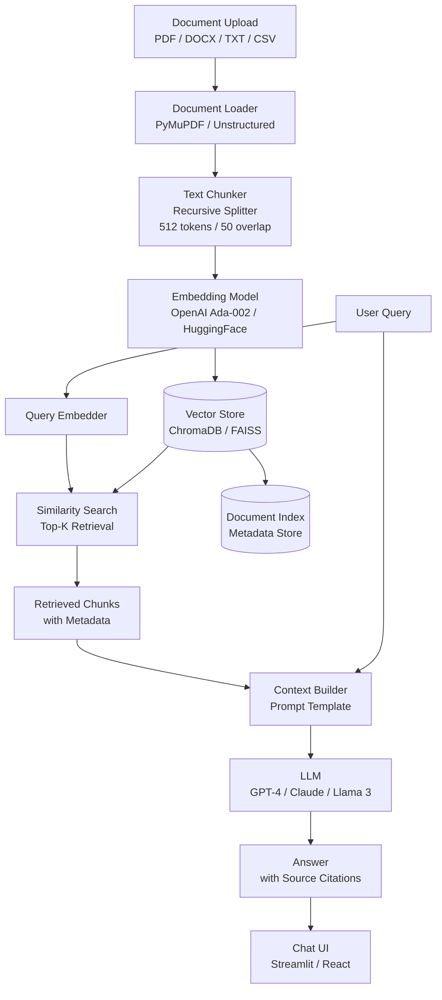

# Document Assistant

An intelligent document Q&A assistant powered by Retrieval-Augmented Generation (RAG). Upload your PDFs, Word docs, or text files and chat with them naturally — get precise, source-cited answers instantly.

## Architecture



## Features

- Multi-format support: PDF, DOCX, TXT, CSV, Markdown
- Contextual Q&A with source highlighting
- Multi-document querying across a knowledge base
- Conversation memory — follow-up questions supported
- Citation of exact page/section sources
- Supports local models (Ollama / Llama 3) or OpenAI
- REST API for programmatic access

## Tech Stack

| Layer | Technology |
|-------|-----------|
| Language | Python 3.10+ |
| Framework | LangChain / LlamaIndex |
| LLM | GPT-4 / Claude 3 / Ollama Llama 3 |
| Embeddings | OpenAI Ada-002 / BGE-M3 |
| Vector DB | ChromaDB / FAISS |
| Document Parsing | PyMuPDF, python-docx, Unstructured |
| UI | Streamlit / React |
| API | FastAPI |

## How to Run

```bash
# 1. Clone and install
git clone https://github.com/jadfarhat-cell/document-assistant.git
cd document-assistant
pip install -r requirements.txt

# 2. Set environment variables
cp .env.example .env
# OPENAI_API_KEY=sk-... (or configure Ollama for local)

# 3. Run Streamlit UI
streamlit run app.py

# 4. Or run FastAPI backend
uvicorn api:app --reload --port 8000

# 5. Ingest documents via CLI
python ingest.py --path ./docs/

# 6. Use with local model (Ollama)
ollama pull llama3
python app.py --model ollama/llama3
```

## Project Structure

```
document-assistant/
├── app.py # Streamlit chat UI
├── api.py # FastAPI REST endpoints
├── ingest.py # Document ingestion pipeline
├── rag/
│ ├── loader.py # Multi-format document loaders
│ ├── chunker.py # Text splitting strategies
│ ├── embedder.py # Embedding generation
│ ├── retriever.py # Vector similarity search
│ └── chain.py # RAG chain assembly
├── vectorstore/ # Persisted ChromaDB index
├── requirements.txt
└── .env.example
```